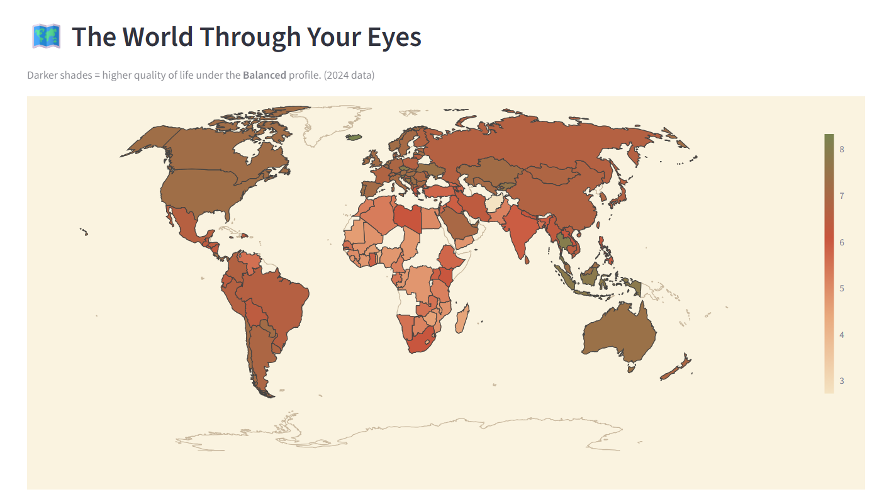
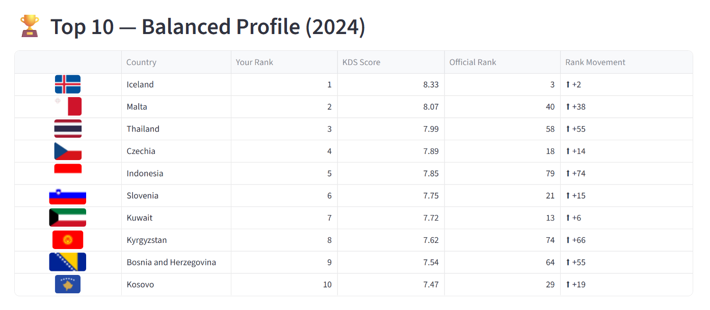
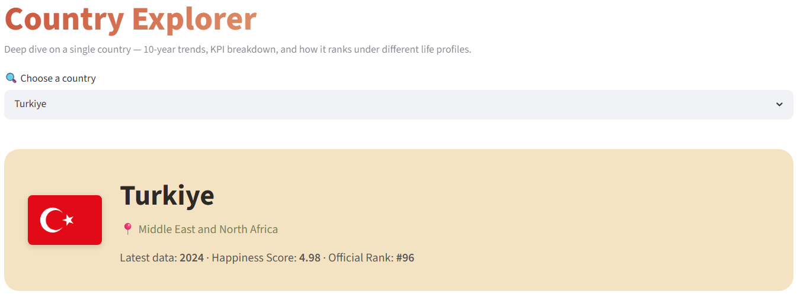
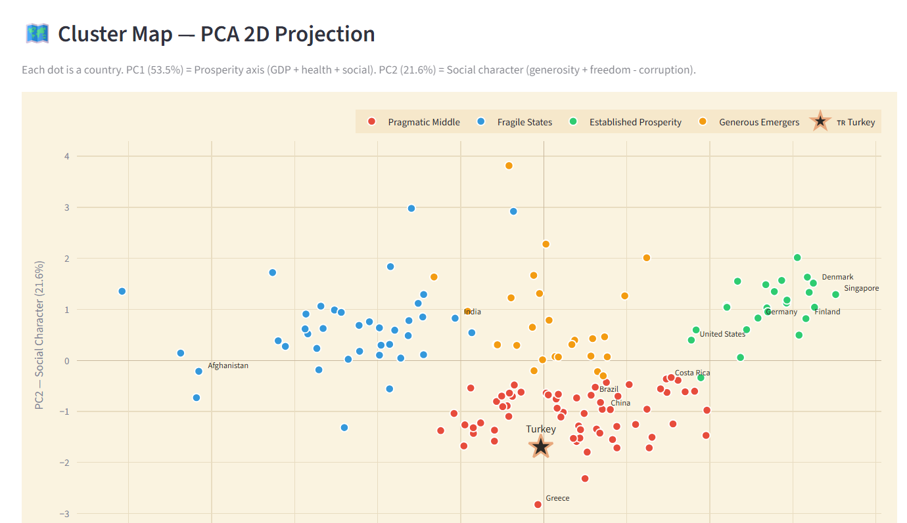
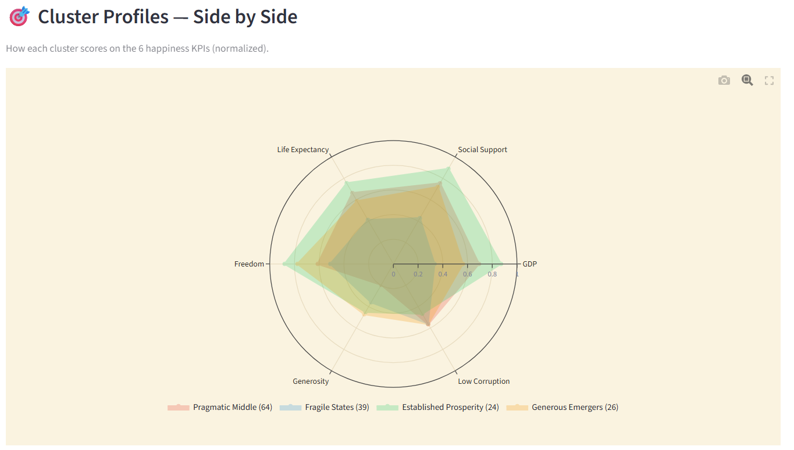
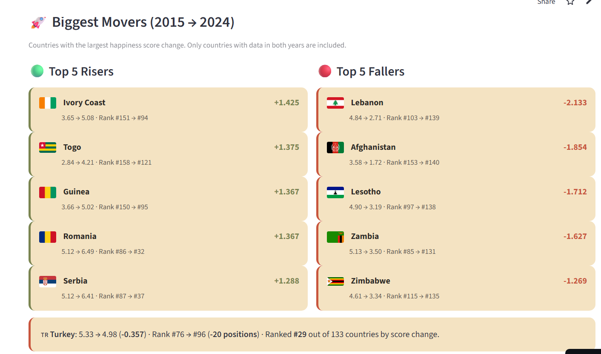

# 🌍 Happiness Decision Dashboard

> **Where should you live?** An interactive decision-support dashboard built on the World Happiness Report (2015-2024). Pick your own priorities — see the world re-rank itself through your lens.

[](https://happiness-decision-dashboard.streamlit.app/)


🔗 **Live demo:** [happiness-decision-dashboard.streamlit.app](https://happiness-decision-dashboard.streamlit.app/)

---



## 🎯 The Idea

Traditional happiness rankings treat everyone the same way. A 22-year-old student studying abroad, a 65-year-old retiree, and a 35-year-old entrepreneur all see the exact same Top-10 list — even though their life priorities are radically different.

This dashboard challenges that. **You set the weights. The world re-ranks accordingly.**

## ✨ Features

| Page | What it does |
|------|--------------|
| 🏠 **Home** | Interactive world map, weight sliders, preset profiles, Turkey spotlight, Top 10 with real flags |
| 🌍 **Country Explorer** | Deep dive on a single country — 10-year trend, radar vs world avg, KPI breakdown, similar countries, profile rankings |
| 🔬 **Clusters** | K-means clustering (k=4) → 4 country archetypes via PCA 2D projection + radar profiles + Turkey's neighbors |
| 📈 **Trends** | Global & regional trajectories, biggest movers, regional heatmap, KPI evolution |

## 📸 Screenshots

### Decision Support — Top 10 by your priorities


### Country Deep Dive


### Country Clusters — PCA Projection


### Cluster Archetypes — Radar Comparison


### Trends Over Time


## 🛠️ Tech Stack

- **Frontend:** Streamlit (multipage) + Plotly + custom CSS (earth tones palette)
- **Data:** pandas, NumPy
- **ML:** scikit-learn (K-means, PCA, StandardScaler)
- **Flags:** [flagcdn.com](https://flagcdn.com/) + pycountry for ISO mapping
- **Deploy:** Streamlit Community Cloud

## 📊 Methodology — How the KDS Score Works

The Decision Support layer is a 4-step pipeline:

1. **Normalization** — All 6 KPIs are min-max scaled to `[0, 1]`. Corruption is inverted (lower perceived corruption = better).
2. **Weighting** — User-defined weights are applied via sliders or preset profiles:3. **Profile templates** — Pre-built weight configurations represent life stages:
   - **Student** — Freedom & social support dominate
   - **Retiree** — Health & low corruption matter most
   - **Family** — Balanced social support & healthcare
   - **Entrepreneur** — Economic strength & freedom
   - **Balanced** — All metrics equal (baseline)
4. **Clustering** — K-means (k=4) on 10-year average country profiles → 4 archetypes:
   - 🏆 **Established Prosperity** (24 countries) — Nordics, Western Europe, ANZ
   - ⚖️ **Pragmatic Middle** (64 countries) — Turkey, Brazil, China, Greece, most of EU periphery
   - 🌱 **Generous Emergers** (26 countries) — Indonesia, Bolivia, parts of Southeast Asia
   - 🏗️ **Fragile States** (39 countries) — Sub-Saharan Africa, conflict zones

PCA reduces 6D to 2D for visualization, retaining **75.2% of variance**.

## 🚀 Quick Start

```bash
git clone https://github.com/yildirimhilal706/happiness-decision-dashboard.git
cd happiness-decision-dashboard

# Create virtual environment
python -m venv venv

# Activate
.\venv\Scripts\Activate.ps1     # Windows PowerShell
source venv/bin/activate         # macOS / Linux

# Install dependencies
pip install -r requirements.txt

# Run the dashboard
streamlit run app/streamlit_app.py
```

The app will open at `http://localhost:8501`.

## 📁 Project Structure## 📂 Data Source

- **Dataset:** [World Happiness 2015-2024 (Kaggle)](https://www.kaggle.com/datasets/hilalyldrm/happiness-decision)
- **Original report:** [worldhappiness.report](https://worldhappiness.report/) — supported by the UN Sustainable Development Solutions Network
- **Coverage:** 175 countries × 10 years × 6 happiness components + happiness score
- **License:** Educational and research use

## 🔑 Key Findings (from the analysis)

- **Turkey ranks #58 for retirees but #107 for students** under the latest data — a 49-position spread depending on what you value most.
- **K-means reveals 4 distinct country archetypes**; Turkey falls in *Pragmatic Middle* alongside Greece, Brazil, Italy and most of Eastern Europe — not in the elite *Established Prosperity* cluster with Northern Europe.
- **Turkey's profile neighbors** (closest by Euclidean distance) are Montenegro, Belarus, Algeria, Greece, Croatia, Hungary — a clear Balkan + Mediterranean Arab profile.
- The official WHR score and our weighted KDS score have **Spearman correlation 0.68-0.84** across profiles — high enough to validate the method, low enough to expose meaningful differences.

## 📝 Articles

- 📖 [Medium (English) — *coming soon*]()
- 📖 [Medium (Türkçe) — Dünyanın en mutlu ülkesi Finlandiya değil, sana bağlı](https://medium.com/@hilalyldrmm2/d%C3%BCnyan%C4%B1n-en-mutlu-%C3%BClkesi-finlandiya-de%C4%9Fil-sana-ba%C4%9Fl%C4%B1-0b076fa07b7a)

## 👥 Contributors

- **[@yildirimhilal706](https://github.com/yildirimhilal706)** — Lead developer, dashboard & deployment
- Co-developed with an MIS graduate (database & dashboard collaborator)

## 📜 License

MIT — see [LICENSE](LICENSE)

---

<p align="center">
  Built with curiosity · Deployed with Streamlit · Designed in earth tones
</p>

